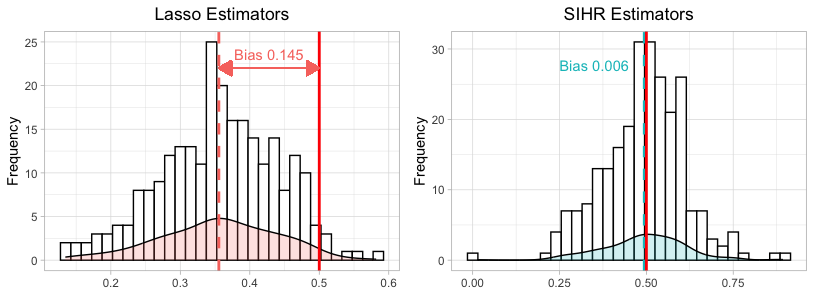
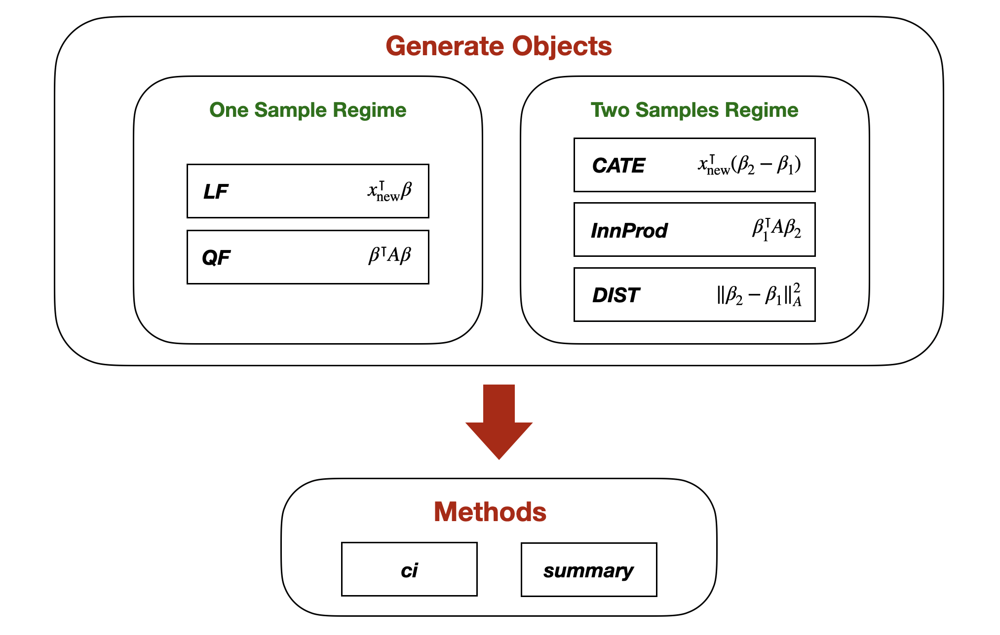

```{r, include = FALSE}
knitr::opts_chunk$set(
  collapse = TRUE,
  comment = "#>",
  fig.path = "man/figures/",
  out.width = "100%"
)
```


# SIHR

The package **SIHR** (**S**tatistics **I**nference for **H**igh-dimensional **R**egression) facilitates statistical inference in high-dimensional generalized linear models (GLM) with continuous and binary outcomes. It offers tools to construct confidence intervals and to conduct hypothesis testing for low-dimensional objectives (e.g. $e_1^\intercal \beta$) in both one-sample and two-sample regression regimes.

## Background
In numerous scenarios, regression problems often involve a number of dimensions $p$ surpassing the sample size $n$. Traditional estimators, derived through penalized maximum likelihood methods like Lasso and Ridge, are unsuitable for statistical inference due to significant estimation bias introduced by the penalty term. Our package leverages debiasing methods, addressing a broad spectrum of inference challenges in high-dimensional GLMs, applicable to both continuous and binary outcomes.

To demonstrate the effect of bias correction, we conducted 250 simulation rounds. The data generation process is defined with $n=p=200$: for $1\leq i\leq n$, the covariates follows $X_i\sim \mathcal{N}({0}_p, \mathbf{I}_p)$, the outcome follows$Y_i = X_i^\intercal \beta + \mathcal{N}(0,1)$, where $\beta= (0.5_{5}, 0.2, 0.4, 0.6, 0.8, 1, {0}_{p-10})$.

Our **objective** is to conduct inference on the first coefficient $e_1^\intercal \beta = 0.5$. However, as illustrated in the left subfigure, Lasso estimators from the **glmnet** package exhibit considerable bias. Conversely, our **SIHR** estimators, shown in the right subfigure, are unbiased and thus ready for valid statistical inference.

```{r, echo=FALSE, fig.align='center', fig.cap="Illustration of Bias Correction", out.width = '80%'}

```


## Installation

You can install the development version from [GitHub](https://github.com/) with:

``` r
# install.packages("devtools")
devtools::install_github("zywang0701/SIHR")
```

## Getting Started
The package consists of 5 main functions in one or two samples regime, with different low-dimensional objectives, respectively.
```{r, echo=FALSE, fig.align='center', fig.cap="Outline of SIHR", out.width = '80%'}

``` 

To illustrate the usage of these functions, we apply SIHR to simulated data in the example.
