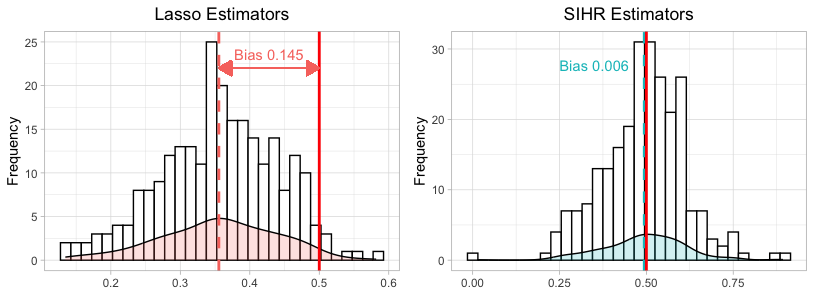

# SIHR

The package **SIHR**(**S**tatistics **I**nference for
**H**igh-dimensional **R**egression) facilitates statistical inference
in high-dimensional generalized linear models (GLM) with continuous and
binary outcomes. It offers tools to construct confidence intervals and
to conduct hypothesis testing for low-dimensional objectives
(e.g. $e_1^\intercal \beta$) in both one-sample and two-sample
regression regimes.

## Background

In numerous scenarios, regression problems often involve a number of
dimensions $p$ surpassing the sample size $n$. Traditional estimators,
derived through penalized maximum likelihood methods like Lasso and
Ridge, are unsuitable for statistical inference due to significant
estimation bias introduced by the penalty term. Our package leverages
debiasing methods, addressing a broad spectrum of inference challenges
in high-dimensional GLMs, applicable to both continuous and binary
outcomes.

To demonstrate the effect of bias correction, we conducted 250 simulation rounds. The data generation process is defined with $n=p=200$: for $1\leq i\leq n$, the covariates follows $X_i\sim \mathcal{N}({0}_p, \mathbf{I}_p)$, the outcome follows$Y_i = X_i^\intercal \beta + \mathcal{N}(0,1)$, where $\beta= (0.5_{5}, 0.2, 0.4, 0.6, 0.8, 1, {0}_{p-10})$.

Our objective was to conduct inference on the first coefficient
$e_1^\intercal \beta = 0.5$. However, as illustrated in the left
subfigure, Lasso estimators from the **glmnet** package exhibit
considerable bias. Conversely, our **SIHR** estimators, shown in the
right subfigure, are unbiased and thus ready for valid statistical
inference.

<div class="figure" style="text-align: center" align="center">


<p class="caption">
Illustration of Bias Correction
</p>

</div>

## Installation

You can install the development version from
[GitHub](https://github.com/) with:

``` r
# install.packages("devtools")
devtools::install_github("zywang0701/SIHR")
```

## Getting Started

The package consists of 5 main functions in one or two samples regime,
with different low-dimensional objectives, respectively. Having fitted
the model, it allows for two methods to report the result.

<div class="figure" style="text-align: center" align="center">


<p class="caption">
Outline of SIHR
</p>

</div>

We have prepared several vignettes to help users get ready with **SIHR**:

* Begin with the [Get Started](./articles/SIHR.html) guide for an initial usage of the package.
* For an in-depth exploration of the package's functionality, consult the [Intro of Usage](./articles/IntroUsage.pdf).
* To gain insights into the debiasing methods incorporated within the package, refer to our [Intro of Debiasing Methods](./articles/IntroMethod.pdf).
